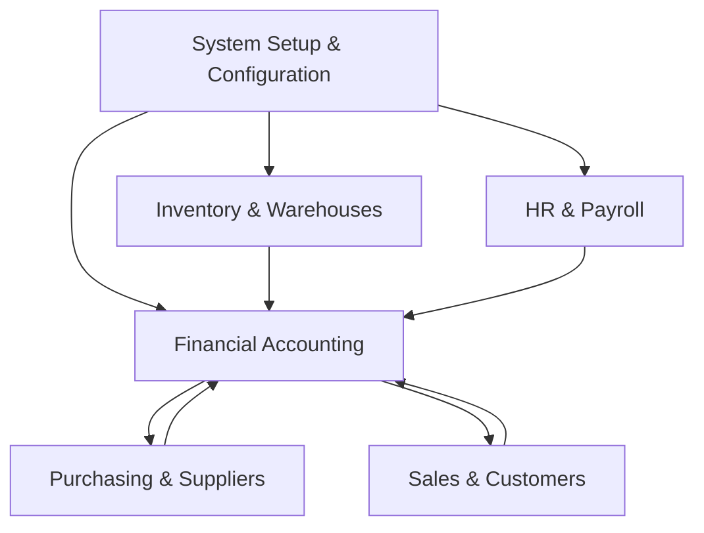
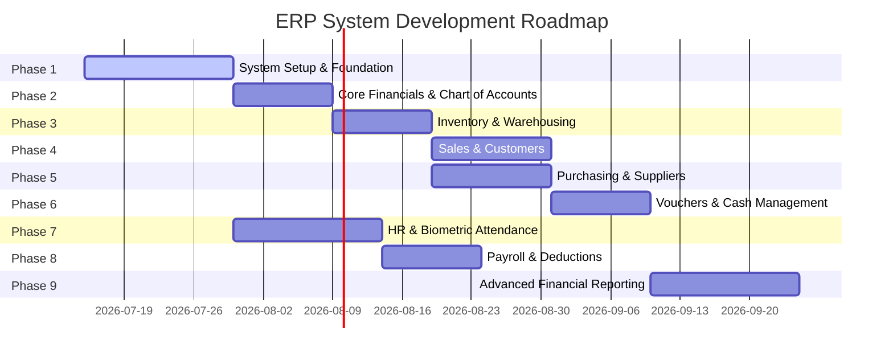

# ERP System Implementation Blueprint (React + PostgreSQL)

This document serves as the complete, professional implementation blueprint for the ERP system. It consolidates the original system requirements, the Stitch UI designs, the technology stack decisions (React SPA frontend + Node.js API backend + PostgreSQL database), and all business logic, financial posting rules, database architecture, and screen specifications.

---

## 1. System Analysis & Module Hierarchy

The ERP system is structured into seven core modules designed for multi-tenant, multi-branch corporate accounting, inventory, sales, purchasing, and human resources.



### Module Breakdown & Data Types

#### 1. System Setup & Configuration (إدارة تهيئة النظام)
*   **Purpose**: Establish enterprise parameters, multi-tenant boundaries (branches), user access rights, and baseline constants.
*   **Master Data**: `Company Profile`, `Branch Directory`, `Currency Rates`, `System Settings`, `User Profiles`, `Access Roles`, `Taxes`, `UOM (Units of Measure)`.
*   **Workflows**: Define corporate variables $\rightarrow$ Setup branches and warehouses $\rightarrow$ Define roles and access rights $\rightarrow$ Provision users.

#### 2. Financial Accounting (المحاسبة المالية)
*   **Purpose**: Process double-entry financial journals, ledger card accounts, cash flow vouchers, and generate balance sheets.
*   **Master Data**: `Chart of Accounts (GL)`, `Cost Centers`, `Financial Periods`.
*   **Transaction Data**: `Journal Entries`, `Receipt Vouchers`, `Payment Vouchers`.
*   **Reports & Dashboards**: `Accounting Cycle Dashboard`, `Trial Balance`, `Account Statement (Ledger)`, `Income Statement`, `Balance Sheet`.

#### 3. Inventory & Warehouses (إدارة المخازن والمستودعات)
*   **Purpose**: Track item profiles, stock movements, and valuation across multiple locations.
*   **Master Data**: `Item Master File`, `Item Categories`, `Warehouse Directory`.
*   **Transaction Data**: `Stock Adjustments`, `Warehouse Transfers` (Gaps in Stitch UI).

#### 4. Purchasing & Suppliers (المشتريات والموردين)
*   **Purpose**: Manage procurement cycles from supplier directory to invoice registration.
*   **Master Data**: `Suppliers Master`.
*   **Transaction Data**: `Purchase Orders`, `Purchase Invoices` (Gap in Stitch UI).
*   **Reports & Dashboards**: `Purchasing Dashboard`.

#### 5. Sales & Customers (المبيعات والعملاء)
*   **Purpose**: Manage customer relations, quotations, sales invoices, and customer returns.
*   **Master Data**: `Customers Master`.
*   **Transaction Data**: `Sales Quotations`, `Sales Invoices`, `Sales Returns`.
*   **Reports & Dashboards**: `Sales Dashboard`.

#### 6. HR & Payroll (الموارد البشرية والرواتب)
*   **Purpose**: Manage employee records, time-attendance logs, time-off requests, and monthly payroll files.
*   **Master Data**: `Employee Database`, `Allowance Types`, `Deduction Types`, `Leave Types`.
*   **Transaction Data**: `Biometric Logs`, `Leave Requests`, `Attendance Register`, `Monthly Payroll Sheet`.
*   **Reports & Dashboards**: `HR Dashboard`, `Monthly Attendance Report`.

#### 7. Reporting & Analytics (لوحة تقارير النظام)
*   **Purpose**: Consolidate analytics from all modules.
*   **Master Data**: None (aggregates operational data).
*   **Reports & Dashboards**: `Reports Dashboard`.

---

## 2. Gap Analysis Report

A comparison between the **System Description (Word Doc)**, the **Stitch UI files**, and the **Word Prompt** reveals critical discrepancies, missing modules, duplicate layouts, and architectural gaps that must be resolved before implementation.

### A. Missing Modules & Screens (Critical Gaps)
1.  **Purchasing Module - Purchase Invoice Entry Screen**: 
    *   *Finding*: The Stitch UI contains `purchase_order_entry` and `purchasing_dashboard` but **completely lacks** a Purchase Invoice Entry screen. In a standard ERP, a Purchase Order is not a financial post; a Purchase Invoice (فاتورة مشتريات) is required to increase inventory valuation and credit Accounts Payable.
    *   *Solution*: Create a new screen `purchase_invoice_entry` modeled after `sales_invoice_entry` but designed for suppliers.
2.  **Inventory Module - Stock Movement Transactions**: 
    *   *Finding*: The Stitch UI only provides warehouse setups (`inventory_management`) and item lists (`inventory_management_dashboard`). It has **no screens** to record Stock Receipts (إدخال مخزني), Stock Issues (صرف مخزني), or Warehouse Transfers (تحويل بين المستودعات).
    *   *Solution*: Create a unified stock transaction screen `stock_transaction_entry` to record these movements.
3.  **Accounting Module - Bank Reconciliation & Closing Entries**:
    *   *Finding*: No screen exists to manage Bank Statements or run end-of-period closing routines.
    *   *Solution*: Provide a utility within the `Accounting Cycle Dashboard` to close financial periods and run year-end ledger closures.
4.  **System Setup - Taxes and Payment Methods Management**:
    *   *Finding*: Mentioned in the system description document, but no UI screens exist to configure tax rates (e.g. VAT 15%, Exempt) or payment methods (Cash, Bank Transfer, Card).
    *   *Solution*: Add configuration tables inside the `system_configuration_dashboard`.

### B. Duplicate / Redundant Screens in Stitch UI
1.  **Customers Management**:
    *   `customer_directory` (H1: "دليل العملاء المركزي") vs `customers_master` (H1: "مؤسسة الأعمال الحديثة")
    *   *Analysis*: Both list customers. `customers_master` is highly detailed with credit limits, tax numbers, and edit/delete actions, while `customer_directory` is a simple contact table.
    *   *Recommendation*: Merge both into a single screen `customers_master` using a toggle or drawer view for directories.
2.  **Suppliers Management**:
    *   `supplier_directory` (H1: "دليل الموردين") vs `suppliers_master` (H1: "مؤسسة الأعمال الحديثة")
    *   *Analysis*: Duplicate concept similar to customers.
    *   *Recommendation*: Merge both into a single `suppliers_master` screen.
3.  **Inventory Naming**:
    *   `inventory_management` (Warehouse List) vs `inventory_management_dashboard` (Item List)
    *   *Analysis*: The naming is visually confusing.
    *   *Recommendation*: Rename `inventory_management` to `warehouse_master` and rename `inventory_management_dashboard` to `items_master`.

### C. Missing Fields & Inconsistent Workflows
*   **Sales Invoice Entry**: Needs a field to link directly to a `Sales Quotation` to auto-populate lines.
*   **Vouchers**: `payment_voucher` and `receipt_voucher` need to link back to invoices to settle accounts receivable/payable, rather than just raw ledger accounts.

---

## 3. Database Architecture (PostgreSQL)

To ensure enterprise-grade scaling and relational integrity, the schema is optimized for **PostgreSQL**.

### PostgreSQL DDL Specifications (Tables Outline)

```sql
-- Enable Extension for UUID Generation
CREATE EXTENSION IF NOT EXISTS "uuid-ossp";

-- Core Setup
CREATE TABLE companies (
    id UUID PRIMARY KEY DEFAULT gen_random_uuid(),
    name_ar VARCHAR(255) NOT NULL,
    name_en VARCHAR(255) NOT NULL,
    logo_path VARCHAR(500),
    tax_number VARCHAR(50) UNIQUE,
    cr_number VARCHAR(50) UNIQUE,
    phone VARCHAR(50),
    email VARCHAR(100),
    address TEXT,
    base_currency_id UUID, -- References currencies
    fiscal_year_start DATE NOT NULL,
    fiscal_year_end DATE NOT NULL,
    created_at TIMESTAMPTZ DEFAULT NOW(),
    updated_at TIMESTAMPTZ DEFAULT NOW()
);

CREATE TABLE branches (
    id UUID PRIMARY KEY DEFAULT gen_random_uuid(),
    company_id UUID REFERENCES companies(id) ON DELETE CASCADE,
    code VARCHAR(50) NOT NULL UNIQUE,
    name_ar VARCHAR(255) NOT NULL,
    name_en VARCHAR(255) NOT NULL,
    manager_id UUID,
    city VARCHAR(100),
    address TEXT,
    phone VARCHAR(50),
    status VARCHAR(20) DEFAULT 'Active' CHECK (status IN ('Active', 'Inactive')),
    created_at TIMESTAMPTZ DEFAULT NOW()
);

CREATE TABLE currencies (
    id UUID PRIMARY KEY DEFAULT gen_random_uuid(),
    code VARCHAR(10) NOT NULL UNIQUE,
    name VARCHAR(100) NOT NULL,
    symbol VARCHAR(10),
    decimal_places INTEGER DEFAULT 2,
    is_default BOOLEAN DEFAULT FALSE,
    status VARCHAR(20) DEFAULT 'Active',
    created_at TIMESTAMPTZ DEFAULT NOW()
);

CREATE TABLE exchange_rates (
    id UUID PRIMARY KEY DEFAULT gen_random_uuid(),
    company_id UUID REFERENCES companies(id) ON DELETE CASCADE,
    currency_id UUID REFERENCES currencies(id) ON DELETE CASCADE,
    rate_date DATE NOT NULL,
    buy_rate NUMERIC(15, 6) NOT NULL,
    sell_rate NUMERIC(15, 6) NOT NULL,
    mid_rate NUMERIC(15, 6) NOT NULL,
    created_at TIMESTAMPTZ DEFAULT NOW(),
    UNIQUE (currency_id, rate_date)
);

CREATE TABLE uoms (
    id UUID PRIMARY KEY DEFAULT gen_random_uuid(),
    code VARCHAR(20) NOT NULL UNIQUE,
    name_ar VARCHAR(100) NOT NULL,
    name_en VARCHAR(100) NOT NULL,
    abbreviation VARCHAR(10) NOT NULL,
    type VARCHAR(50) NOT NULL CHECK (type IN ('Weight', 'Length', 'Volume', 'Quantity')),
    base_uom_id UUID REFERENCES uoms(id),
    conversion_factor NUMERIC(15, 6) DEFAULT 1.0,
    status VARCHAR(20) DEFAULT 'Active',
    created_at TIMESTAMPTZ DEFAULT NOW()
);

CREATE TABLE item_categories (
    id UUID PRIMARY KEY DEFAULT gen_random_uuid(),
    code VARCHAR(50) NOT NULL UNIQUE,
    name_ar VARCHAR(255) NOT NULL,
    name_en VARCHAR(255) NOT NULL,
    parent_category_id UUID REFERENCES item_categories(id),
    status VARCHAR(20) DEFAULT 'Active',
    created_at TIMESTAMPTZ DEFAULT NOW()
);

CREATE TABLE warehouses (
    id UUID PRIMARY KEY DEFAULT gen_random_uuid(),
    branch_id UUID REFERENCES branches(id) ON DELETE CASCADE,
    code VARCHAR(50) NOT NULL UNIQUE,
    name VARCHAR(255) NOT NULL,
    manager_id UUID,
    location TEXT,
    capacity NUMERIC(15, 2),
    status VARCHAR(20) DEFAULT 'Active',
    created_at TIMESTAMPTZ DEFAULT NOW()
);

CREATE TABLE gl_accounts (
    id UUID PRIMARY KEY DEFAULT gen_random_uuid(),
    company_id UUID REFERENCES companies(id) ON DELETE CASCADE,
    code VARCHAR(50) NOT NULL UNIQUE,
    name_ar VARCHAR(255) NOT NULL,
    name_en VARCHAR(255) NOT NULL,
    parent_id UUID REFERENCES gl_accounts(id),
    account_level INTEGER NOT NULL,
    account_type VARCHAR(50) NOT NULL CHECK (account_type IN ('Asset', 'Liability', 'Equity', 'Revenue', 'Expense')),
    nature VARCHAR(10) NOT NULL CHECK (nature IN ('Debit', 'Credit')),
    currency_id UUID REFERENCES currencies(id),
    status VARCHAR(20) DEFAULT 'Active',
    created_at TIMESTAMPTZ DEFAULT NOW()
);

CREATE TABLE cost_centers (
    id UUID PRIMARY KEY DEFAULT gen_random_uuid(),
    company_id UUID REFERENCES companies(id) ON DELETE CASCADE,
    code VARCHAR(50) NOT NULL UNIQUE,
    name_ar VARCHAR(255) NOT NULL,
    name_en VARCHAR(255) NOT NULL,
    parent_id UUID REFERENCES cost_centers(id),
    manager_id UUID,
    budget NUMERIC(15, 4) DEFAULT 0.0000,
    status VARCHAR(20) DEFAULT 'Active',
    created_at TIMESTAMPTZ DEFAULT NOW()
);

CREATE TABLE departments (
    id UUID PRIMARY KEY DEFAULT gen_random_uuid(),
    branch_id UUID REFERENCES branches(id) ON DELETE CASCADE,
    code VARCHAR(50) NOT NULL UNIQUE,
    name_ar VARCHAR(255) NOT NULL,
    name_en VARCHAR(255) NOT NULL,
    manager_id UUID,
    status VARCHAR(20) DEFAULT 'Active',
    created_at TIMESTAMPTZ DEFAULT NOW()
);

CREATE TABLE users (
    id UUID PRIMARY KEY DEFAULT gen_random_uuid(),
    username VARCHAR(100) NOT NULL UNIQUE,
    password_hash VARCHAR(255) NOT NULL,
    employee_id UUID, -- References employees
    role_id UUID, -- References roles
    branch_id UUID REFERENCES branches(id),
    language VARCHAR(10) DEFAULT 'ar',
    status VARCHAR(20) DEFAULT 'Active',
    created_at TIMESTAMPTZ DEFAULT NOW()
);

CREATE TABLE roles (
    id UUID PRIMARY KEY DEFAULT gen_random_uuid(),
    company_id UUID REFERENCES companies(id) ON DELETE CASCADE,
    name_ar VARCHAR(255) NOT NULL,
    name_en VARCHAR(255) NOT NULL,
    description TEXT,
    created_at TIMESTAMPTZ DEFAULT NOW()
);

CREATE TABLE permissions (
    id UUID PRIMARY KEY DEFAULT gen_random_uuid(),
    role_id UUID REFERENCES roles(id) ON DELETE CASCADE,
    module_name VARCHAR(100) NOT NULL,
    screen_name VARCHAR(100) NOT NULL,
    can_view BOOLEAN DEFAULT FALSE,
    can_create BOOLEAN DEFAULT FALSE,
    can_edit BOOLEAN DEFAULT FALSE,
    can_delete BOOLEAN DEFAULT FALSE,
    can_approve BOOLEAN DEFAULT FALSE,
    can_print BOOLEAN DEFAULT FALSE,
    can_export BOOLEAN DEFAULT FALSE,
    UNIQUE (role_id, module_name, screen_name)
);

CREATE TABLE journal_entries (
    id UUID PRIMARY KEY DEFAULT gen_random_uuid(),
    entry_number VARCHAR(100) NOT NULL UNIQUE,
    entry_date DATE NOT NULL,
    description TEXT,
    reference_no VARCHAR(100),
    status VARCHAR(20) DEFAULT 'Draft' CHECK (status IN ('Draft', 'Approved', 'Posted', 'Void')),
    branch_id UUID REFERENCES branches(id),
    created_by UUID REFERENCES users(id),
    approved_by UUID REFERENCES users(id),
    posted_at TIMESTAMPTZ,
    created_at TIMESTAMPTZ DEFAULT NOW()
);

CREATE TABLE journal_entry_lines (
    id UUID PRIMARY KEY DEFAULT gen_random_uuid(),
    journal_entry_id UUID REFERENCES journal_entries(id) ON DELETE CASCADE,
    gl_account_id UUID REFERENCES gl_accounts(id) NOT NULL,
    cost_center_id UUID REFERENCES cost_centers(id),
    debit NUMERIC(15, 4) DEFAULT 0.0000,
    credit NUMERIC(15, 4) DEFAULT 0.0000,
    line_description TEXT
);

CREATE TABLE customers (
    id UUID PRIMARY KEY DEFAULT gen_random_uuid(),
    company_id UUID REFERENCES companies(id) ON DELETE CASCADE,
    code VARCHAR(50) NOT NULL UNIQUE,
    name_ar VARCHAR(255) NOT NULL,
    name_en VARCHAR(255) NOT NULL,
    phone VARCHAR(50),
    email VARCHAR(100),
    city VARCHAR(100),
    address TEXT,
    tax_number VARCHAR(50),
    credit_limit NUMERIC(15, 4) DEFAULT 0.0000,
    opening_balance NUMERIC(15, 4) DEFAULT 0.0000,
    currency_id UUID REFERENCES currencies(id),
    status VARCHAR(20) DEFAULT 'Active',
    created_at TIMESTAMPTZ DEFAULT NOW()
);

CREATE TABLE suppliers (
    id UUID PRIMARY KEY DEFAULT gen_random_uuid(),
    company_id UUID REFERENCES companies(id) ON DELETE CASCADE,
    code VARCHAR(50) NOT NULL UNIQUE,
    name_ar VARCHAR(255) NOT NULL,
    name_en VARCHAR(255) NOT NULL,
    contact_person VARCHAR(100),
    phone VARCHAR(50),
    email VARCHAR(100),
    tax_number VARCHAR(50),
    credit_limit NUMERIC(15, 4) DEFAULT 0.0000,
    opening_balance NUMERIC(15, 4) DEFAULT 0.0000,
    currency_id UUID REFERENCES currencies(id),
    status VARCHAR(20) DEFAULT 'Active',
    created_at TIMESTAMPTZ DEFAULT NOW()
);

CREATE TABLE items (
    id UUID PRIMARY KEY DEFAULT gen_random_uuid(),
    company_id UUID REFERENCES companies(id) ON DELETE CASCADE,
    code VARCHAR(50) NOT NULL UNIQUE,
    name_ar VARCHAR(255) NOT NULL,
    name_en VARCHAR(255) NOT NULL,
    uom_id UUID REFERENCES uoms(id),
    category_id UUID REFERENCES item_categories(id),
    cost_price NUMERIC(15, 4) DEFAULT 0.0000,
    selling_price NUMERIC(15, 4) DEFAULT 0.0000,
    reorder_level NUMERIC(15, 4) DEFAULT 0.0000,
    barcode VARCHAR(100) UNIQUE,
    status VARCHAR(20) DEFAULT 'Active',
    created_at TIMESTAMPTZ DEFAULT NOW()
);

CREATE TABLE sales_invoices (
    id UUID PRIMARY KEY DEFAULT gen_random_uuid(),
    invoice_number VARCHAR(100) NOT NULL UNIQUE,
    invoice_date DATE NOT NULL,
    customer_id UUID REFERENCES customers(id) NOT NULL,
    branch_id UUID REFERENCES branches(id) NOT NULL,
    warehouse_id UUID REFERENCES warehouses(id) NOT NULL,
    payment_method_id UUID,
    currency_id UUID REFERENCES currencies(id) NOT NULL,
    total_amount NUMERIC(15, 4) DEFAULT 0.0000,
    discount_amount NUMERIC(15, 4) DEFAULT 0.0000,
    tax_amount NUMERIC(15, 4) DEFAULT 0.0000,
    net_amount NUMERIC(15, 4) DEFAULT 0.0000,
    status VARCHAR(20) DEFAULT 'Draft',
    journal_entry_id UUID REFERENCES journal_entries(id),
    created_by UUID REFERENCES users(id),
    zatca_uuid UUID DEFAULT gen_random_uuid(),
    zatca_invoice_hash VARCHAR(256),
    zatca_xml_payload TEXT,
    zatca_cryptographic_counter INT DEFAULT 1,
    created_at TIMESTAMPTZ DEFAULT NOW()
);

CREATE TABLE sales_invoice_lines (
    id UUID PRIMARY KEY DEFAULT gen_random_uuid(),
    sales_invoice_id UUID REFERENCES sales_invoices(id) ON DELETE CASCADE,
    item_id UUID REFERENCES items(id) NOT NULL,
    uom_id UUID REFERENCES uoms(id) NOT NULL,
    quantity NUMERIC(15, 4) NOT NULL,
    unit_price NUMERIC(15, 4) NOT NULL,
    discount_percentage NUMERIC(5, 2) DEFAULT 0.00,
    tax_amount NUMERIC(15, 4) DEFAULT 0.0000,
    total_amount NUMERIC(15, 4) NOT NULL
);

CREATE TABLE employees (
    id UUID PRIMARY KEY DEFAULT gen_random_uuid(),
    employee_number VARCHAR(50) NOT NULL UNIQUE,
    name_ar VARCHAR(255) NOT NULL,
    name_en VARCHAR(255) NOT NULL,
    department_id UUID REFERENCES departments(id),
    job_title VARCHAR(100),
    branch_id UUID REFERENCES branches(id),
    hire_date DATE NOT NULL,
    contract_type VARCHAR(20) DEFAULT 'Single',
    basic_salary NUMERIC(15, 4) DEFAULT 0.0000,
    status VARCHAR(20) DEFAULT 'Active',
    created_at TIMESTAMPTZ DEFAULT NOW()
);

CREATE TABLE attendances (
    id UUID PRIMARY KEY DEFAULT gen_random_uuid(),
    employee_id UUID REFERENCES employees(id) ON DELETE CASCADE,
    date DATE NOT NULL,
    check_in TIME,
    check_out TIME,
    work_hours NUMERIC(5, 2) DEFAULT 0.00,
    delay_hours NUMERIC(5, 2) DEFAULT 0.00,
    overtime_hours NUMERIC(5, 2) DEFAULT 0.00,
    status VARCHAR(20) DEFAULT 'Present',
    created_at TIMESTAMPTZ DEFAULT NOW(),
    UNIQUE (employee_id, date)
);

CREATE TABLE audit_logs (
    id UUID PRIMARY KEY DEFAULT gen_random_uuid(),
    user_id UUID REFERENCES users(id),
    action_type VARCHAR(50) NOT NULL,
    table_name VARCHAR(100) NOT NULL,
    record_id UUID NOT NULL,
    old_values JSONB,
    new_values JSONB,
    ip_address VARCHAR(45),
    timestamp TIMESTAMPTZ DEFAULT NOW()
);
```

---

## 4. Development Roadmap

The development is divided into 9 phases to ensure dependencies are resolved in order.



### Phase Details

#### Phase 1: System Foundation & Configuration
*   **Objectives**: Establish central databases, localization parameters, multiple branches, access rights, and auditing.
*   **Database Tables**: `companies`, `branches`, `currencies`, `exchange_rates`, `users`, `roles`, `permissions`, `settings`, `audit_logs`.
*   **APIs**: Authentication (JWT login, refresh), Setup APIs (CRUD for company profile, branches, currency rates, permissions).
*   **UI Screens**: `system_configuration_dashboard`, `branch_management`, `currency_exchange_rates`, `users_permissions`.
*   **Dependencies**: None.

#### Phase 2: Core Financials (General Ledger)
*   **Objectives**: Create Chart of Accounts (COA) hierarchical trees, cost centers, and the transaction journal analysis page.
*   **Database Tables**: `gl_accounts`, `cost_centers`.
*   **APIs**: `gl_accounts` tree nodes, `cost_centers` CRUD, `/api/transactions` validation and saving.
*   **UI Screens**: `chart_of_accounts`, `cost_centers_management`, `transaction_analysis`.
*   **Dependencies**: Phase 1.

#### Phase 3: Inventory & Warehouse Master
*   **Objectives**: Set up physical warehouses, define Units of Measure (UOM), categories, and the Item Master File.
*   **Database Tables**: `warehouses`, `uoms`, `item_categories`, `items`, `inventory_transactions`, `inventory_transaction_lines`.
*   **APIs**: Warehouse CRUD, UOM conversion calculations, Item Master CRUD, Stock movements.
*   **UI Screens**: `inventory_management` (Warehouse setup), `units_of_measure`, `inventory_management_dashboard` (Items Master setup).
*   **Dependencies**: Phase 1 & 2.

#### Phase 4: Sales Module & Customers
*   **Objectives**: Centralize Customer Master files, issue quotes, process invoices, and manage returns.
*   **Database Tables**: `customers`, `sales_quotations`, `sales_quotation_lines`, `sales_invoices`, `sales_invoice_lines`, `sales_returns`, `sales_return_lines`.
*   **APIs**: Customer CRUD, Sales Quotation conversion to invoice, Invoice calculations (VAT 15%, discounts), Return validation against original invoice.
*   **UI Screens**: `customers_master` (Merged), `sales_dashboard`, `sales_quotation_entry`, `sales_invoice_entry`, `_2` (Invoice print template), `sales_return_entry`.
*   **Dependencies**: Phase 3.

#### Phase 5: Purchasing Module & Suppliers
*   **Objectives**: Centralize Supplier Master files, issue purchase orders, and record supplier invoices.
*   **Database Tables**: `suppliers`, `purchase_orders`, `purchase_order_lines`, `purchase_invoices`, `purchase_invoice_lines`.
*   **APIs**: Supplier CRUD, Purchase Order approval, Purchase Invoice calculations (updates stock costs & levels).
*   **UI Screens**: `suppliers_master` (Merged), `purchasing_dashboard`, `purchase_order_entry`, `purchase_invoice_entry` (New UI).
*   **Dependencies**: Phase 3.

#### Phase 6: Vouchers & Cash Management
*   **Objectives**: Record cash/bank receipts and payments, automatically linking them to ledger accounts and invoice settlement.
*   **Database Tables**: `receipt_vouchers`, `payment_vouchers`, `payment_methods`.
*   **APIs**: Receipt Voucher save (auto-creates AR entry), Payment Voucher save (auto-creates AP entry).
*   **UI Screens**: `receipt_voucher`, `payment_voucher`.
*   **Dependencies**: Phase 4 & 5.

#### Phase 7: HR & Biometric Attendance
*   **Objectives**: Maintain Employee Profiles, collect biometric logs, log daily attendance, and request leaves.
*   **Database Tables**: `employees`, `biometric_logs`, `attendances`, `leave_requests`, `leave_types`, `departments`.
*   **APIs**: Employee CRUD, Biometric Log upload, Attendance generator, Leave request routing.
*   **UI Screens**: `employee_database`, `attendance_register`, `monthly_attendance_report`, `leave_management`, `hr_dashboard`.
*   **Dependencies**: Phase 1.

#### Phase 8: Payroll & Allowances
*   **Objectives**: Configure recurring allowances and deductions, calculate net payroll sheets, and export banking files.
*   **Database Tables**: `allowances`, `allowance_types`, `deductions`, `deduction_types`, `payrolls`, `payroll_lines`.
*   **APIs**: Allowances CRUD, Monthly Payroll Engine (calculates work hours, delay deductions, basic, net), Bank file exporter (WPS format).
*   **UI Screens**: `allowances_deductions`, `payroll_sheet`.
*   **Dependencies**: Phase 7 & Phase 2.

#### Phase 9: Financial Period Close & Advanced Reports
*   **Objectives**: Post entries to General Ledger, generate Trial Balance sheets, and render Income Statements and Balance Sheets.
*   **Database Tables**: Read-only access to all ledger transactions.
*   **APIs**: Trial Balance generator (grouping by account levels), Income Statement calculations, Balance Sheet checks (Assets = Liabilities + Equity).
*   **UI Screens**: `_1` (Accounting Cycle Dashboard), `trial_balance`, `account_details` (Account ledger), `financial_statements_dashboard` (Balance Sheet / Income Statement), `reports_dashboard`.
*   **Dependencies**: Phase 6 & Phase 8.

---

## 5. Screen Mapping & Specifications

| Screen Name | Purpose | DB Tables Used | Related Modules | Inputs | Outputs |
| :--- | :--- | :--- | :--- | :--- | :--- |
| **`Accounting Cycle Dashboard`** (`_1`) | Visual guide of accounting steps | None (Navigation UI) | Accounting | Click coordinates | Page routing |
| **`Sales Invoice Print`** (`_2`) | Printable A4 layout for sales receipts | `sales_invoices`, `companies` | Sales, Setup | Invoice ID | A4 Printout / PDF |
| **`Account Details`** (`account_details`) | View detailed movements of a specific GL Account | `gl_accounts`, `journal_entry_lines` | Accounting | Account ID, Date Range, Branch | Ledger Card, Excel Export |
| **`Allowances & Deductions`** (`allowances_deductions`) | Configure recurring employee pay variables | `allowances`, `deductions` | HR, Payroll | Employee ID, Amount, Type | Updated Pay Formula |
| **`Attendance Register`** (`attendance_register`) | Log daily checks, work, overtime, delay | `attendances`, `employees` | HR | Check In/Out Times | Work Hours, Delay stats |
| **`Branch Management`** (`branch_management`) | Configure physical outlets of the firm | `branches` | Setup | Branch name, manager, location | Active branch entity |
| **`Chart of Accounts`** (`chart_of_accounts`) | Structured tree of financial accounts | `gl_accounts` | Accounting | Account Code, Type, Nature | Account Tree Node |
| **`Cost Centers`** (`cost_centers_management`) | Track budgets against business segments | `cost_centers` | Accounting | Center name, parent, budget | Cost Center structure |
| **`Currency Exchange`** (`currency_exchange_rates`) | Multi-currency configuration & rates | `currencies`, `exchange_rates` | Setup | Currency Code, Symbol, Rate | Exchange Rate Ledger |
| **`Customers Master`** (`customers_master`) | Combined directory & master customer file | `customers` | Sales | Customer name, Tax ID, Credit Limit | Customer Account profile |
| **`Employee Database`** (`employee_database`) | Core worker metadata directory | `employees`, `departments` | HR | Personal info, Basic Salary | Employee Profile |
| **`Financial Statements`** (`financial_statements_dashboard`) | Displays Income Statement & Balance Sheet | `journal_entry_lines`, `gl_accounts` | Accounting | Fiscal year, period | Balance Sheet, Income Statement |
| **`HR Dashboard`** (`hr_dashboard`) | Analytics panel for HR activity | `employees`, `leave_requests` | HR | Date filters | Absence graphs, new hire lists |
| **`Warehouse Master`** (`inventory_management`) | Configure warehouse nodes | `warehouses`, `branches` | Inventory | Code, Name, Capacity, Branch | Active warehouse entity |
| **`Items Master`** (`inventory_management_dashboard`) | Define item catalog and min-stock limits | `items`, `item_categories`, `uoms` | Inventory | Barcode, Cost, Price, Reorder level | Item Catalog profile |
| **`Leave Management`** (`leave_management`) | Route and approve time-off requests | `leave_requests`, `employees` | HR | Start/End Date, Type, Reason | Approved leave entry |
| **`Monthly Attendance`** (`monthly_attendance_report`) | Grid report of attendance for the month | `attendances`, `employees` | HR, Payroll | Month, Year, Department | 31-day attendance grid |
| **`Payment Voucher`** (`payment_voucher`) | Record payments to vendors/expenses | `payment_vouchers`, `journal_entries` | Accounting, Purchasing | Supplier ID, Paid amount, Bank/Cash | Posted Expense Journal |
| **`Payroll Sheet`** (`payroll_sheet`) | Calculate net monthly salaries | `payroll_lines`, `employees` | HR, Payroll | Month/Year | Net salary sheet, bank file |
| **`Purchase Order`** (`purchase_order_entry`) | Place product order with supplier | `purchase_orders`, `purchase_order_lines` | Purchasing | Supplier ID, Item, Quantity, Cost | Purchase Order PDF |
| **`Purchase Invoice`** *(New)* | Record supplier invoice and record AP | `purchase_invoices`, `purchase_invoice_lines` | Purchasing, Inventory | PO ID, Vendor Invoice number | Updated stock count, Ledger voucher |
| **`Purchasing Dashboard`** (`purchasing_dashboard`) | Track purchase order cycles | `purchase_orders`, `suppliers` | Purchasing | Date filters | PO status charts, overdue list |
| **`Receipt Voucher`** (`receipt_voucher`) | Record funds collection from clients | `receipt_vouchers`, `journal_entries` | Accounting, Sales | Customer ID, Received amount, Cash/Bank | Posted Collection Journal |
| **`Reports Dashboard`** (`reports_dashboard`) | Main library of system reports | None (Aggregator) | Reporting | Selected Report Type | PDF/Excel file downloads |
| **`Sales Dashboard`** (`sales_dashboard`) | Analytics panel for sales revenue | `sales_invoices` | Sales | Date filters | Sales charts, top items |
| **`Sales Invoice`** (`sales_invoice_entry`) | Enter customer sales invoices | `sales_invoices`, `sales_invoice_lines` | Sales, Inventory | Customer ID, Warehouse, Item, Qty | Saved Invoice, Stock decrease |
| **`Sales Quotation`** (`sales_quotation_entry`) | Create price quotes for customer | `sales_quotations`, `sales_quotation_lines` | Sales | Customer ID, Item list, Quote prices | Printed Quote |
| **`Sales Return`** (`sales_return_entry`) | Record credit note for return | `sales_returns`, `sales_return_lines` | Sales, Inventory | Sales Invoice ID, Return Quantity | Credit Note, Stock increase |
| **`Suppliers Master`** (`suppliers_master`) | Combined directory & master supplier file | `suppliers` | Purchasing | Supplier name, Tax ID, Credit Limit | Supplier Account profile |
| **`System Configuration`** (`system_configuration_dashboard`) | Setup core company profiles and roles | `companies`, `roles`, `users` | Setup | Tax rules, Company name, logo | Setup configs |
| **`Transaction Analysis`** (`transaction_analysis`) | Verify and book journal double-entries | `journal_entries`, `journal_entry_lines` | Accounting | Account code, Debit, Credit, Statement | Balanced Ledger Voucher |
| **`Trial Balance`** (`trial_balance`) | Trial balance verification report | `journal_entry_lines`, `gl_accounts` | Accounting | Period, Branch | Debit/Credit balance table |
| **`Units of Measure`** (`units_of_measure`) | Configure units & ratios (e.g. Box to Pcs) | `uoms` | Setup, Inventory | Code, Abbreviation, Base UOM, Factor | UOM convert ratio |
| **`Users & Permissions`** (`users_permissions`) | Define staff accounts and access matrices | `users`, `roles`, `permissions` | Setup | Username, Employee ID, Access flags | Access permissions |

---

## 6. Complete Screen Descriptions & UI Specifications

The following outlines the detailed Software Design Specification (SDS) for all 21 screens in the system, incorporating React state inputs and PostgreSQL schemas.

### Screen 1: Accounting Cycle Dashboard (`_1` / `accounting_cycle_dashboard`)
*   **Goal**: Provide a central homepage showing the steps of the accounting cycle.
*   **UI/UX Design**: Dynamic graphical board with cards styled using Equilibrium corporate themes. Includes top bars for corporate identity (logo, current date) and a side navigation bar on the right.
*   **Fields & Controls**:
    *   Dynamic cards for steps 1 through 9.
    *   "Open Screen" (فتح الشاشة) button on each card.
*   **Database Tables**: None.
*   **Inputs**: Mouse clicks/selections.
*   **Outputs**: React navigation routing.
*   **Relationships**: Connects users to the other ledger entry and reporting sheets.

### Screen 2: Sales Invoice Print Layout (`_2` / `sales_invoice_print`)
*   **Goal**: Clean, A4-formatted, print-ready document template for invoices.
*   **UI/UX Design**: Clean white background, no side menus. Top: Company header (Logo, Name, Tax Number) and Invoice details. Middle: Structured table of products. Bottom: Financial breakdown, terms, and compliance QR code.
*   **Fields & Controls**: None (Print View).
*   **Database Tables**: `sales_invoices`, `sales_invoice_lines`, `companies`, `customers`.
*   **Inputs**: Invoice ID.
*   **Outputs**: PDF document or physical print printout.
*   **Relationships**: Serves as the print template for invoices generated in the Sales Invoice Entry screen.

### Screen 3: Items Master (`inventory_management_dashboard`)
*   **Goal**: Catalog products, manage base costs, pricing, and reorder levels.
*   **UI/UX Design**: Tabular item catalog with custom status chips (Green = Stocked, Red = Reorder Alert).
*   **Fields & Controls**:
    *   `item_code` / `barcode` (Inputs)
    *   `cost_price` / `selling_price` (Inputs)
    *   `reorder_level` (Input)
*   **Database Tables**: `items`, `item_categories`, `uoms`.
*   **Inputs**: Item creation inputs.
*   **Outputs**: Active item profiles.
*   **Relationships**: Reference data for all transactions in sales, returns, and purchases.

### Screen 4: Transaction Analysis (`transaction_analysis`)
*   **Goal**: Verify and staging double-entry adjustments before bookkeeping.
*   **UI/UX Design**: Dual form layout. Top metadata, bottom transaction line grid. Total debits must equal total credits before saving.
*   **Fields & Controls**:
    *   `transaction_date` (Date picker)
    *   `ref_no` (Text input)
    *   Grid: `gl_account` (Select), `debit` (Numeric), `credit` (Numeric).
*   **Database Tables**: `gl_accounts`, `journal_entries`, `journal_entry_lines`.
*   **Inputs**: Accounting details.
*   **Outputs**: Posted GL entries.
*   **Relationships**: Staged data is verified here before posting to the ledger.

| **`Journal Entries`** (`journal_entries`) | Manage general journal header and detail posting, approval workflow, and balanced ledger entry posting | `journal_entries`, `journal_entry_lines`, `gl_accounts`, `branches`, `cost_centers`, `projects`, `currencies` | Accounting | Journal No, Date, Debit, Credit, Status | Balanced Journal, Posted Ledger |
| **`Financial Statements`** (`financial_statements_dashboard`) | Displays Income Statement & Balance Sheet | `journal_entry_lines`, `gl_accounts` | Accounting | Fiscal year, period | Balance Sheet, Income Statement |

### Screen 5: Journal Entries (`journal_entries`)
*   **Goal**: Create a professional Journal Entries workspace that manages all accounting journal entries produced by manual posting or by upstream systems, while enforcing double-entry accounting and posting only balanced journals.
*   **UI/UX Design**: Modern ERP Accounting Workspace with RTL support, card-based layout, white background, wide spacing, dark blue headings, turquoise primary buttons, green success messages, orange warnings, red errors, and responsive design. Uses Segoe UI / Inter fonts.
*   **Header Bar**:
    *   Screen title: قيود اليومية / Journal Entries
    *   Company name
    *   Current branch
    *   Financial period
    *   Fiscal year
    *   Current user
    *   System date and time
*   **Journal Header Fields**:
    *   Journal Number (auto-generated)
    *   Journal Type: Manual, Automated, Opening, Adjustment, Closing
    *   Journal Date
    *   Posting Date
    *   Reference
    *   Document Number
    *   Main Statement
    *   Branch
    *   Currency
    *   Exchange Rate (for foreign currency)
    *   Default Cost Center
    *   Project (optional)
    *   Status: Draft, Pending Approval, Approved, Posted, Cancelled
    *   Created By
    *   Created At
*   **Journal Details Table**:
    *   Columns: Line No, Account No, Account Name, Statement, Cost Center, Project, Debit, Credit, Currency, Exchange Rate, Amount in Base Currency, Notes
    *   Unlimited line insertion
    *   Account selection from Chart of Accounts
    *   Automatic account name fill
    *   Account search autocomplete
    *   Multi-row paste support
    *   Drag-and-drop row reordering
    *   Add/delete row controls
    *   Prevent debit and credit entry on same row
    *   Auto-calculate base currency amount for foreign currency rows
*   **Validation Panel**:
    *   Total Debit
    *   Total Credit
    *   Difference
    *   Line Count
    *   Number of accounts used
    *   Journal status
    *   If difference = 0 then show “✔ Journal Balanced” with green background
    *   If difference ≠ 0 then show “✖ Journal Unbalanced” with red background and the difference amount
*   **Action Bar**:
    *   New
    *   Save
    *   Edit
    *   Delete
    *   Copy Journal
    *   Reverse Journal
    *   Approve
    *   Unapprove
    *   Post
    *   Unpost (depending on permission)
    *   Print Journal Voucher
    *   Export PDF
    *   Export Excel
    *   Send by Email
    *   Advanced Search
    *   Audit Log
    *   Close
*   **Journal Lifecycle**:
    *   Draft → Save → Review → Approve → Post → General Ledger → Trial Balance → Financial Statements
    *   The next stage is only allowed after all verifications succeed.
*   **Validation Rules**:
    *   Total Debit = Total Credit
    *   Cannot save without details
    *   Cannot use inactive accounts
    *   Cannot use closed financial period
    *   Validate branch
    *   Validate cost center
    *   Validate currency
    *   Prevent duplicate account usage if company policy forbids it
    *   Validate user permissions
    *   Prevent editing posted journals
    *   Prevent deleting posted journals
    *   Record all operations in Audit Log
*   **Search Window**:
    *   Advanced search by Journal No, Journal Type, Period, Branch, Account, User, Status, From Date, To Date, Cost Center, Currency, Reference
    *   Result table columns: Journal No, Date, Statement, Debit, Credit, Status, User
*   **Smart UX Features**:
    *   Professional data grid
    *   Instant search
    *   Account autocomplete
    *   Data validation
    *   Conditional formatting
    *   Keyboard shortcuts
    *   Accounting number formatting
    *   Multi-currency support
    *   Sticky headers while scrolling
    *   Column sorting and filtering
    *   Hide/show columns
*   **Integration**:
    *   Chart of Accounts
    *   Branches
    *   Cost Centers
    *   Projects
    *   Currencies
    *   Financial Periods
    *   Transaction Analysis
    *   General Ledger
    *   Trial Balance
    *   Adjustment Journals
    *   Financial Statements
    *   Sales
    *   Purchases
    *   Inventory
    *   Payroll
    *   Fixed Assets
    *   Permissions
    *   Notifications
*   **Data Sources**:
    *   Journal Entry Header table
    *   Journal Entry Details table
    *   Chart of Accounts
    *   Branches
    *   Cost Centers
    *   Projects
    *   Currencies
    *   Financial Periods
    *   Users
    *   Permissions
*   **Outputs**:
    *   Journal voucher
    *   General Ledger entries
    *   Updated account balances
    *   Updated trial balance
    *   Updated financial statements
    *   Updated daily movement reports
    *   Audit trail
    *   PDF and Excel export files
*   **User Experience**:
    *   Professional ERP feel, not just a data form
    *   Fast operations, keyboard shortcuts, smooth field navigation
    *   Clear validation messages
    *   Auto-save drafts
    *   Visual journal status using colors and icons

### Screen 6: Financial Statements (`financial_statements_dashboard`)
*   **Goal**: Render Balance Sheet and Income Statement side-by-side.
*   **UI/UX Design**: Dual card layouts displaying detailed financial metrics.
*   **Fields & Controls**:
    *   `date_filter` (Date Picker)
    *   `export_pdf` (Action Button)
*   **Database Tables**: `journal_entry_lines`, `gl_accounts`.
*   **Inputs**: Filter criteria.
*   **Outputs**: PDF statements.
*   **Relationships**: Consolidates entries from general ledger postings.

### Screen 6: Trial Balance Worksheet (`trial_balance`)
*   **Goal**: Display consolidated account balances for audit and period closing.
*   **UI/UX Design**: Aggregated report grid. Columns show Account Code, Account Name, Opening Balance (Dr/Cr), Monthly Activity (Dr/Cr), and Ending Balance (Dr/Cr). Bottom features a green/red balance verification banner.
*   **Fields & Controls**:
    *   `fiscal_period` / `branch` (Select Dropdowns)
    *   `refresh_button` (Action control)
*   **Database Tables**: `gl_accounts`, `journal_entry_lines`, `journal_entries`.
*   **Inputs**: Period filters.
*   **Outputs**: Balanced Trial Balance sheet.
*   **Relationships**: Aggregates all ledger accounts, validating the entire system balance.

### Screen 7: Attendance Register (`attendance_register`)
*   **Goal**: Log check-ins and check-outs, calculating work, delay, and overtime.
*   **UI/UX Design**: Attendance table showing daily employee activity with columns for check-in time, check-out time, total work hours, delay hours, and overtime hours. Highlights absences in red.
*   **Fields & Controls**:
    *   `from_date` / `to_date` (Date Pickers)
    *   `employee_search` (Text Input)
    *   `biometric_sync_button` (Action control)
*   **Database Tables**: `attendances`, `employees`.
*   **Inputs**: Check-in/out records.
*   **Outputs**: Daily work time summaries.
*   **Relationships**: Feed attendance metrics directly into the monthly attendance report.

### Screen 8: Sales Invoice Entry (`sales_invoice_entry`)
*   **Goal**: Record customer sales, calculate VAT, reduce warehouse stock, and update general accounts.
*   **UI/UX Design**: Top bar features payment method quick-select tabs (Cash, Credit, Bank Transfer). Left column displays invoice details (Customer, Warehouse, Date, Sales rep). Right column contains the item entry list. Bottom-right features a prominent Totals panel.
*   **Fields & Controls**:
    *   `customer_id` (Dropdown)
    *   `warehouse_id` (Dropdown)
    *   Grid Rows: `item_id` (Select), `quantity` (Numeric), `selling_price` (Auto-populated), `discount` (Numeric %), `tax_amount` (Auto-computed), `total_amount` (Auto-computed).
*   **Database Tables**: `sales_invoices`, `sales_invoice_lines`, `customers`, `items`, `warehouses`, `journal_entries`, `journal_entry_lines`.
*   **Inputs**: Invoice line items.
*   **Outputs**: Recorded sales invoice, ZATCA e-invoice hash, stock reductions, and double-entry accounting posting.
*   **Relationships**: Integrates with items and warehouses (stock decrements). Generates ledger journal postings. Feeds invoice data to print templates.

### Screen 9: Account Details Statement (`account_details`)
*   **Goal**: Generate ledger statements (ledger cards) showing all movements affecting a specific account.
*   **UI/UX Design**: Filter bar on top (Account selection, Date range, Branch). Bottom section displays a large table listing historical journal items with a running balance column.
*   **Fields & Controls**:
    *   `account_select` (Dropdown with search autocomplete)
    *   `from_date` / `to_date` (Date Pickers)
*   **Database Tables**: `gl_accounts`, `journal_entry_lines`, `journal_entries`.
*   **Inputs**: Filter criteria.
*   **Outputs**: Tabular ledger statements.
*   **Relationships**: Reads data from general ledger postings.

### Screen 10: Chart of Accounts (`chart_of_accounts`)
*   **Goal**: Manage the corporate tree structure of general ledger accounts.
*   **UI/UX Design**: Tree view layout (nested collapsible list). Right side shows tree nodes, left side displays edit forms for selected nodes.
*   **Fields & Controls**:
    *   `account_code` (Text Input - Numeric tree hierarchy)
    *   `account_name_ar` / `name_en` (Text Inputs)
    *   `account_type` (Dropdown: Asset, Liability, Equity, Revenue, Expense)
    *   `account_nature` (Dropdown: Debit, Credit)
    *   `parent_account` (Select Dropdown)
*   **Database Tables**: `gl_accounts`.
*   **Inputs**: Account nodes.
*   **Outputs**: COA schema.
*   **Relationships**: Chart of Accounts is the core framework for all double-entry postings, journal items, vouchers, and statements.

### Screen 11: Customers Master (`customers_master`)
*   **Goal**: Centralize customer records, credit limits, tax numbers, and aging analysis.
*   **UI/UX Design**: Modern card list layout with a detailed view drawer. Contains tabs for "Customer Details", "Transaction History", and "Aging Statement".
*   **Fields & Controls**:
    *   `customer_code` (Auto-generated)
    *   `customer_name` (Text Input)
    *   `tax_number` (Text Input - 15 digits)
    *   `credit_limit` (Numeric Input)
    *   `opening_balance` (Numeric Input)
    *   `currency` (Dropdown)
*   **Database Tables**: `customers`, `currencies`.
*   **Inputs**: Customer profiles.
*   **Outputs**: Active customer profiles.
*   **Relationships**: Provides customer details to sales quotations, sales invoices, sales returns, and receipt vouchers.

### Screen 12: Suppliers Master (`suppliers_master`)
*   **Goal**: Centralize supplier records, contact details, tax numbers, and payment terms.
*   **UI/UX Design**: Directory list on the right, profile details tab on the left. Displays tabs for "Supplier Info", "Purchase Orders", and "Accounts Payable Statement".
*   **Fields & Controls**:
    *   `supplier_code` (Auto-generated)
    *   `supplier_name` (Text Input)
    *   `contact_person` (Text Input)
    *   `tax_number` (Text Input - 15 digits)
    *   `credit_limit` (Numeric Input)
    *   `opening_balance` (Numeric Input)
*   **Database Tables**: `suppliers`.
*   **Inputs**: Supplier profile details.
*   **Outputs**: Active supplier directory.
*   **Relationships**: Supplies vendor information to purchase orders, purchase invoices, and payment vouchers.

### Screen 13: Receipt Voucher (`receipt_voucher`)
*   **Goal**: Record collections of cash or bank payments from customers.
*   **UI/UX Design**: Form-focused layout. Left: Voucher parameters (Voucher number, Date, Customer selection). Right: Payment method details (Cash, Bank Account, Check numbers).
*   **Fields & Controls**:
    *   `voucher_date` (Date Picker)
    *   `customer_id` (Dropdown)
    *   `amount` (Numeric Input)
    *   `payment_method` (Select: Cash, Card, Transfer, Check)
    *   `bank_account` (Select)
    *   `statement` (Text Area)
*   **Database Tables**: `receipt_vouchers`, `customers`, `payment_methods`, `gl_accounts`.
*   **Inputs**: Collection data.
*   **Outputs**: Receipt voucher record, automatic General Ledger posting (Debit: Bank/Cash, Credit: Customer's Accounts Receivable).
*   **Relationships**: Links collections to customer balances (`customers_master`). Posts accounting entries to GL.

### Screen 14: Payment Voucher (`payment_voucher`)
*   **Goal**: Record cash or bank disbursements to suppliers or other expenses.
*   **UI/UX Design**: Form grid. Top: Voucher number, Date, Beneficiary info. Middle: Expense lines. Bottom: Payment details (Disbursement cash/bank account, Cheque reference).
*   **Fields & Controls**:
    *   `beneficiary_name` (Text Input)
    *   `supplier_id` (Dropdown - Nullable)
    *   `amount` (Numeric Input)
    *   `disbursement_account` (Select)
    *   `lines`: `gl_account` (Select), `cost_center` (Select), `amount` (Numeric), `notes` (Text).
*   **Database Tables**: `payment_vouchers`, `suppliers`, `payment_methods`, `gl_accounts`.
*   **Inputs**: Disbursement data.
*   **Outputs**: Payment voucher record, automatic General Ledger posting (Debit: Supplier AP / Expense Account, Credit: Bank/Cash).
*   **Relationships**: Settle vendor ledger entries in `suppliers_master`. Posts accounting entries to GL.

### Screen 15: Employee Database (`employee_database`)
*   **Goal**: Central registry of employee profiles, contract terms, basic salaries, and job assignments.
*   **UI/UX Design**: Searchable list view with quick filters on the right (Branch, Department). Clicking an employee card slides out a profile details panel.
*   **Fields & Controls**:
    *   `employee_number` (Auto-generated)
    *   `name_ar` / `name_en` (Text Inputs)
    *   `department_id` / `branch_id` (Dropdowns)
    *   `job_title` (Text Input)
    *   `hire_date` (Date Picker)
    *   `basic_salary` (Numeric Input)
    *   `status` (Dropdown: Active, Suspended, Terminated)
*   **Database Tables**: `employees`, `departments`, `branches`.
*   **Inputs**: Employee profiles.
*   **Outputs**: Active employee profiles.
*   **Relationships**: Provides reference details for attendance sheets, leave requests, payroll files, and users.

### Screen 16: Monthly Attendance Report (`monthly_attendance_report`)
*   **Goal**: Generate monthly calendar reports of employee attendance patterns.
*   **UI/UX Design**: Grid calendar report. Left columns list employee names, middle columns show calendar days (1 to 31) with colored status badges (Green = Present, Red = Absent, Yellow = Leave, Gray = Weekend). Right columns display totals.
*   **Fields & Controls**:
    *   `month_select` / `year_select` (Dropdowns)
    *   `department_id` (Dropdown)
*   **Database Tables**: `attendances`, `employees`.
*   **Inputs**: Report filters.
*   **Outputs**: Monthly attendance spreadsheets.
*   **Relationships**: Supplies total delay and absence metrics to the payroll calculations table.

### Screen 17: Leave Management (`leave_management`)
*   **Purpose**: Process, review, and approve employee leave requests.
*   **UI/UX Layout**: Split screen. Right: "New Leave Request" form. Left: List of pending requests with action buttons (Approve, Reject).
*   **Fields & Controls**:
    *   `employee_id` (Dropdown)
    *   `leave_type` (Dropdown: Annual, Sick, Unpaid)
    *   `start_date` / `end_date` (Date Pickers)
    *   `reason` (Text Area)
*   **Database Tables**: `leave_requests`, `employees`, `leave_types`.
*   **Inputs**: Leave requests.
*   **Outputs**: Approved leave records.
*   **Relationships**: Blocked dates are sent to the attendance registers, automatically marking employee statuses as "Leave".

### Screen 18: HR Dashboard (`hr_dashboard`)
*   **Goal**: Central overview of employee statistics, daily attendance, and time-off request lists.
*   **UI/UX Design**: KPI cards displaying Total Employees, Active Employees, On Leave Today, and Absence Rates. Split section: Department distribution pie chart on the right, monthly attendance bar charts on the left.
*   **Fields & Controls**:
    *   `branch_tabs` (Riyadh, Jeddah, Dammam tabs to filter data)
*   **Database Tables**: `employees`, `attendances`, `leave_requests`.
*   **Inputs**: View filters.
*   **Outputs**: Visual workforce analytics.
*   **Relationships**: Reads data from employee records, attendance records, and leave request tables.

### Screen 19: Payroll Sheet (`payroll_sheet`)
*   **Goal**: Calculate net monthly salaries, verify allowances and lateness deductions.
*   **UI/UX Design**: Summary boxes showing totals. Detail rows calculate basic, allowances, GOSI, overtime, delay deductions, and net salary.
*   **Fields & Controls**:
    *   `pay_period` (Select: Month, Year)
    *   `recalculate_button` (Action control)
    *   `approve_button` (Locks payroll and triggers accounting entries)
*   **Database Tables**: `payrolls`, `payroll_lines`, `employees`, `attendances`, `allowances`, `deductions`.
*   **Inputs**: Period selections.
*   **Outputs**: Final payroll sheet, bank transfer files (WPS), and automatic journal entries.
*   **Relationships**: Reads data from employee records, attendance reports, and allowances/deductions. Generates payroll journal entries.

### Screen 20: Allowances & Deductions (`allowances_deductions`)
*   **Goal**: Manage allowances, food, transport, and custom pay variables.
*   **UI/UX Design**: Double-card layout. Left card: Allowances setup table. Right card: Deductions setup table. Clicking edit opens a modal to configure pay rules.
*   **Fields & Controls**:
    *   `employee_select` (Dropdown)
    *   `allowance_type` / `deduction_type` (Dropdowns)
    *   `amount` (Numeric Input)
    *   `is_recurring` (Toggle switch)
*   **Database Tables**: `allowances`, `deductions`, `employees`.
*   **Inputs**: Pay adjustments.
*   **Outputs**: Active allowance/deduction rules.
*   **Relationships**: Provides adjustment figures directly to the payroll calculations table.

### Screen 21: Reports Dashboard (`reports_dashboard`)
*   **Goal**: Unified reporting portal providing access to all system reports.
*   **UI/UX Design**: Library card grid. Cards are grouped by functional modules: Financial Reports (Trial Balance, Ledger, Balance Sheet), Sales Reports (Revenue by Customer), Stock Reports (Stock Ledger, Under-Stock), HR Reports (Attendance sheets).
*   **Fields & Controls**:
    *   `report_search` (Text Input)
    *   `generate_report_button` (Action control)
*   **Database Tables**: Read-only queries on all tables.
*   **Inputs**: Report filters.
*   **Outputs**: PDF/Excel downloads.
*   **Relationships**: Serves as a central reporting console reading data from across the system.

---

## 7. Core Business & Financial Posting Rules

To ensure compliance with general accounting standards (IFRS) and Saudi tax regulations (ZATCA), the following rules must be enforced in code.

### A. Financial Posting & Ledger Rules
1.  **Double-Entry Balance Constraint**: No Journal Entry, Sales Invoice, Purchase Invoice, or Voucher can be posted unless:
    $$\sum \text{Debits} = \sum \text{Credits}$$
    Attempts to post unbalanced entries must throw a validation error.
2.  **Locked Financial Periods**: Transactions cannot be posted to a `FinancialPeriod` where `is_closed` is true. Retroactive entries require reopening the period (restricted to designated supervisors).
3.  **Automatic Ledger Mapping (Vouchers)**:
    *   **Receipt Voucher**: Debits the selected Cash/Bank account; Credits the Customer's Accounts Receivable account.
    *   **Payment Voucher**: Debits the Supplier's Accounts Payable (or Expense) account; Credits the selected Bank/Cash account.
4.  **Automatic Invoice Postings**:
    *   **Sales Invoice**:
        *   *Debit*: Customer's Accounts Receivable (Total Net)
        *   *Credit*: Sales Revenue Account (Total before Tax)
        *   *Credit*: VAT Output Liability Account (VAT Tax amount)
        *   *Debit*: Cost of Goods Sold (COGS) Account (Stock Cost)
        *   *Credit*: Inventory Asset Account (Stock Cost)
    *   **Purchase Invoice**:
        *   *Debit*: Inventory Asset Account (Invoice Cost)
        *   *Debit*: VAT Input Account (VAT Tax amount)
        *   *Credit*: Supplier's Accounts Payable Account (Total Net)

### B. Currency & Exchange Rules
*   **Base Currency Reference**: The system records all ledger postings in the base corporate currency (e.g., SAR).
*   **Exchange Rate Locking**: If a transaction is recorded in a foreign currency, the system must fetch the rate from `CurrencyExchangeRate` for the transaction date. If no rate is set, the user must input it manually, which is locked for that specific document.

### C. Inventory & Valuation Rules
*   **Costing Method**: The system uses the **Weighted Average Cost (WAC)** method to value inventory.
    $$\text{New Average Cost} = \frac{(\text{Current Qty} \times \text{Current WAC}) + (\text{Received Qty} \times \text{Purchase Price})}{\text{Current Qty} + \text{Received Qty}}$$
*   **Negative Stock Protection**: If "Prevent Negative Stock" is enabled, a Sales Invoice or Stock Issue must throw an exception if:
    $$\text{Quantity to Issue} > \text{Available Stock in Warehouse}$$
*   **Reorder Alerts**: When stock levels drop below the defined `reorder_level` on the item profile, the item must be flagged as `under_minimum = true` to appear on the `Inventory Management Dashboard` with a warning highlight.

### D. HR & Payroll Processing Rules
*   **Overtime Calculations**: Overtime hourly rate is calculated as:
    $$\text{Overtime Hour Value} = \frac{\text{Basic Salary}}{30 \times 8} \times 1.5$$
*   **Delay Deductions**: Lateness is calculated daily based on check-in tolerances (e.g., grace period of 15 minutes). Lateness exceeding this is accumulated monthly and deducted from the payroll sheet.
*   **GOSI (Social Insurance) Deduction**: For Saudi employees, GOSI deductions must be applied according to Saudi labor laws (e.g., 9.75% basic salary deduction for employee share, 11.75% for employer share).

### E. Security & Audit Logging
*   **No Physical Deletes on Ledger**: Posted Journal Entries, Vouchers, or Invoices cannot be physically deleted (`DELETE` statements are prohibited). Correction requires a reversing entry (Void/Credit Note).
*   **Audit Trail Capture**: Any update (`UPDATE`) or insert (`INSERT`) on critical master records (employee salaries, bank accounts, prices) must write a record to the `AuditLog` containing the username, IP address, timestamp, and a JSON diff of the changed attributes.

---

## 8. Recommendations & System Improvements

Before beginning database setup and coding, we recommend the following modifications to resolve design bottlenecks:

### Recommendations

> [!IMPORTANT]
> **1. Merge Customer and Supplier Directory Duplicate Screens**
> Do not build separate `customer_directory` and `supplier_directory` pages. Instead, implement a tabbed interface or toggle within `customers_master` and `suppliers_master`. This reduces UI maintenance and keeps code DRY.

> [!WARNING]
> **2. Introduce a Purchase Invoice Screen**
> Implement a dedicated `purchase_invoice_entry` screen in Phase 5. Relying only on `purchase_order_entry` prevents proper inventory costing and accrual accounting.

> [!NOTE]
> **3. Add Stock Adjustment Vouchers**
> Introduce a simple `stock_adjustment` form to allow warehouse managers to correct stock counts after physical audits.

> [!TIP]
> **4. Implement Unified ZATCA E-Invoicing Hook**
> Structure the `SalesInvoice` database table to contain UUID, Hash, and XML payload fields. This ensures the system architecture is ready for future integration with the ZATCA Phase 2 clearance/reporting APIs.

---

## 9. Verification & QA Plan

### Automated Tests
1.  **Unit Tests (Backend)**:
    *   Verify balanced entry validator: `test_journal_entry_balance_constraint()` (assert error if Debit != Credit).
    *   Verify Weighted Average Cost calculation: `test_wac_recalculation_on_purchase_invoice()`.
    *   Verify negative stock blocker: `test_block_sales_invoice_if_insufficient_stock()`.
    *   Verify payroll salary calculator: `test_payroll_calculation_with_overtime_and_delay()`.
2.  **Integration Tests**:
    *   Verify that approving a Sales Invoice automatically generates a balanced Journal Entry and decreases stock levels in `Warehouse`.
    *   Verify that approving a Leave Request marks the employee's attendance as "Leave" on the corresponding dates in `Attendance`.

### Manual QA
*   **A4 Print Layout Check**: Deploy the app locally and test `Sales Invoice Print Template` (`_2`) in the browser. Print to PDF to verify it fits on a single A4 sheet without margin truncation.
*   **RTL Mirroring Validation**: Toggle the language to Arabic and verify that the navigation bar moves to the right, tables mirror correctly, and data alignments align according to the `DESIGN.md` guidelines.
